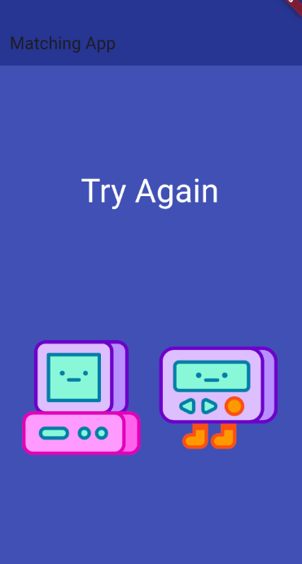

# Flutter Learning Process

This repository documents my journey of learning Flutter, a popular framework for building cross-platform mobile applications using a single codebase.

## Project : [MatchingApp]

Description: This Matching Game when you click to image it change and if it match it will say "Well Done".

## License

This project is licensed under the [Ali Alsheala](LICENSE).
